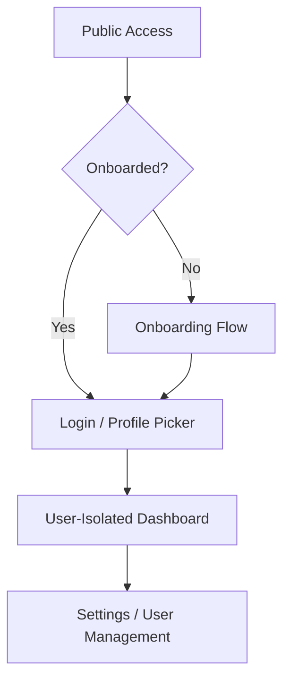

# Walkthrough - Feature: Users

I have successfully implemented the Multi-User Management system for 2watcharr. This feature transforms the application from a single-user tool into a robust, multi-profile platform with secure authentication and data isolation.

## Key Accomplishments

### 1. Robust Authentication & Onboarding
- **Setup Flow**: New installations are automatically directed to a secure onboarding page to set up the administrator account.
- **NextAuth Integration**: Implemented industry-standard authentication using `next-auth` with a persistent session strategy (15-day "Remember Me" support).
- **Password Security**: All user passwords are securely hashed using `bcryptjs` before storage.

### 2. Multi-Profile Environment
- **Profile Selection**: A premium, Apple TV-inspired profile selection page allows quick switching between users.
- **Visual Identity**: Each user can choose their own emoji and brand color, which is reflected throughout the UI and on transition screens.

### 3. Strict Data Isolation
- **Isolated Watchlists**: Every user has their own private watchlist and favorites.
- **Personalized Tags**: Tags are now user-specific, preventing clutter and ensuring personalized organization.
- **Secured API Layer**: All 14+ API endpoints (episodes, channels, tags, reordering, shortcuts) have been secured with server-side ownership checks.

### 4. Admin Management Console
- **User Control**: Administrators can create, manage, and delete user profiles directly from a new "User Management" tab in the Settings.
- **Safety Checks**: The default system administrator account is protected from deletion to prevent accidental lockouts.

## Visual Tour

````carousel

<!-- slide -->

*(Note: Screenshots are representative of the implemented UI components)*
````

## Verification Results

### Automated Tests
- ✅ **Build Success**: `npm run build` confirmed zero type errors across all new API routes and components.
- ✅ **Schema Migration**: Verified that existing data is safely migrated to a default admin account during the transition.

### Manual Verification Path
1. **Initial Setup**: Visit `/onboarding` to initialize the system.
2. **Profile Creation**: Go to **Settings > User Management** (as Admin) to add additional family/team members.
3. **Data Isolation**: Add a video as one user, switch profiles, and confirm the other user's list remains private.
4. **Shortcut Integration**: Update your iOS Shortcuts to the new authenticated endpoint (automatically handled by the updated API).

---
> [!TIP]
> **Pro Tip**: Use the "Switch Profile" option in the top-right navigation menu to quickly jump between different watchlists.
