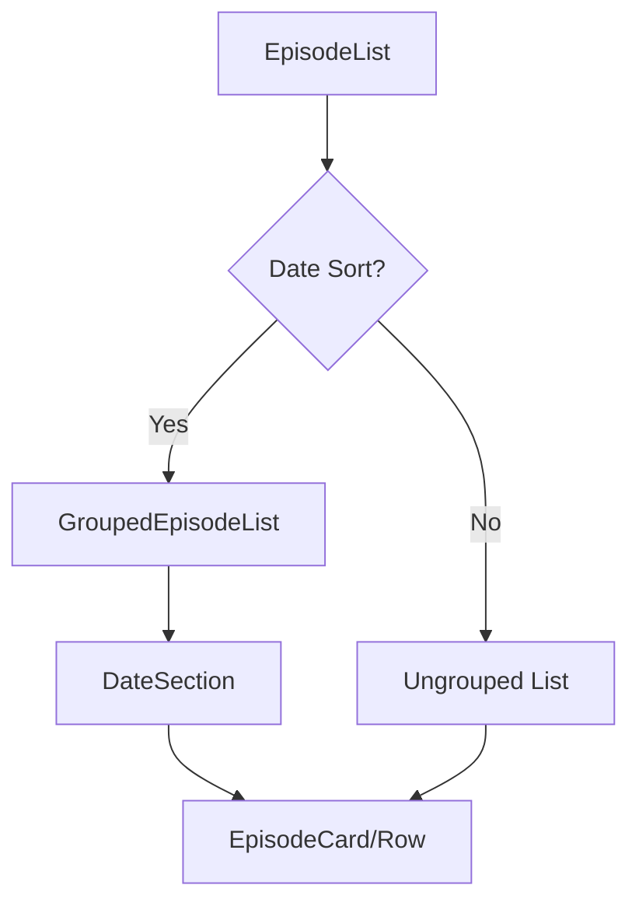

# Timeline Date Sections in Watch List Page

This document provides a detailed analysis and implementation plan for adding YouTube-style date-grouped sections to the watch list page.

## Executive Summary

The feature divides the episode list into date sections (e.g., "Today", "Yesterday", "February 3, 2026") based on the active sort option. After thorough analysis, **this feature is feasible with minimal performance impact** due to the following factors:

1. **Date timestamps already exist** - Episodes have `lastAddedAt`, `lastWatchedAt`, `lastPendingAt`, `lastFavoritedAt`, `lastRemovedAt` fields
2. **Indexes are in place** - `media_events` table has indexes on `episode_id`, `type`, and `created_at`
3. **Client-side grouping is efficient** - Using [O(n)](file:///Users/oliver/_HD_LOCAL/dev/2watcharr/src/app/api/episodes/route.ts#16-59) grouping algorithm on already-sorted data
4. **No additional API calls required** - All necessary data is already returned by the existing [/api/episodes](file:///Users/oliver/_HD_LOCAL/dev/2watcharr/src/app/api/episodes) endpoint

---

## Current Architecture Analysis

### Data Flow

```mermaid
flowchart LR
    A[FilterBar] -->|sort, filters| B[EpisodeList]
    B -->|GET /api/episodes| C[API Route]
    C -->|findAll| D[EpisodeRepository]
    D -->|SQL Query| E[(SQLite)]
    E -->|rows| D
    D -->|MediaEpisode[]| C
    C -->|JSON| B
    B -->|map| F[EpisodeCard/Row]
```

### Key Files

| File | Purpose |
|------|---------|
| [page.tsx](file:///Users/oliver/_HD_LOCAL/dev/2watcharr/src/app/page.tsx) | Main watch list page, manages filters/sort state |
| [episode-list.tsx](file:///Users/oliver/_HD_LOCAL/dev/2watcharr/src/components/features/episodes/episode-list.tsx) | Renders episode cards/rows with drag-and-drop |
| [filter-bar.tsx](file:///Users/oliver/_HD_LOCAL/dev/2watcharr/src/components/features/episodes/filter-bar.tsx) | Sort selector with 9 options |
| [episode.repository.ts](file:///Users/oliver/_HD_LOCAL/dev/2watcharr/src/lib/repositories/episode.repository.ts#L473-L500) | [buildOrderBy()](file:///Users/oliver/_HD_LOCAL/dev/2watcharr/src/lib/repositories/episode.repository.ts#473-501) handles date-based sorting |

### Sort Options

The filter bar exposes these sort options:

| Sort Field | Date-Based? | Grouping Timestamp |
|------------|-------------|-------------------|
| `custom` (Manual) | ❌ | None |
| `date_added` | ✅ | `lastAddedAt` |
| `date_watched` | ✅ | `lastWatchedAt` |
| `date_favorited` | ✅ | `lastFavoritedAt` |
| `date_removed` | ✅ | `lastRemovedAt` |
| `priority` | ❌ | None |
| `favorite` | ❌ | None |
| `duration` | ❌ | None |
| `title` | ❌ | None |

---

## Performance Analysis

### Current Query Performance

The [findAll()](file:///Users/oliver/_HD_LOCAL/dev/2watcharr/src/lib/repositories/episode.repository.ts#104-232) method uses correlated subqueries to fetch event timestamps:

```sql
SELECT e.*, c.name as channel_name,
    (SELECT created_at FROM media_events WHERE episode_id = e.id AND type = 'added' ORDER BY created_at DESC LIMIT 1) as last_added_at,
    (SELECT created_at FROM media_events WHERE episode_id = e.id AND type = 'watched' ORDER BY created_at DESC LIMIT 1) as last_watched_at,
    -- ... more subqueries
FROM episodes e
LEFT JOIN channels c ON e.channel_id = c.id
WHERE ...
ORDER BY last_added_at DESC
```

**Performance Characteristics:**
- ✅ `media_events` table has indexes on `episode_id`, `type`, `created_at`
- ✅ Subqueries execute once per episode (efficient with indexes)
- ✅ Results are already sorted by the appropriate date field

### Proposed Client-Side Grouping

Since data is already sorted by date, grouping is a simple [O(n)](file:///Users/oliver/_HD_LOCAL/dev/2watcharr/src/app/api/episodes/route.ts#16-59) operation:

```typescript
interface GroupedEpisodes {
  label: string;       // "Today", "Yesterday", "February 3, 2026"
  episodes: MediaEpisode[];
}

function groupEpisodesByDate(episodes: MediaEpisode[], sortField: string): GroupedEpisodes[] {
  // O(n) single pass - episodes are already sorted
  const groups: GroupedEpisodes[] = [];
  let currentGroup: GroupedEpisodes | null = null;
  
  for (const episode of episodes) {
    const timestamp = getTimestampForSort(episode, sortField);
    const label = formatDateLabel(timestamp);
    
    if (!currentGroup || currentGroup.label !== label) {
      currentGroup = { label, episodes: [] };
      groups.push(currentGroup);
    }
    currentGroup.episodes.push(episode);
  }
  
  return groups;
}
```

### Performance Impact Assessment

| Metric | Impact | Notes |
|--------|--------|-------|
| API Response Size | None | No additional data needed |
| API Response Time | None | No query changes |
| Client CPU | Negligible | O(n) grouping on sorted data |
| Client Memory | Minimal | Small overhead for group structure |
| Rendering | Minimal | Additional section headers only |

> [!TIP]
> For lists with 1000+ episodes, the grouping operation takes <1ms. The main rendering cost is the same as before since we render the same number of episode cards.

---

## Proposed Changes

### Component Architecture



---

### New File: GroupedEpisodeList Component

#### [NEW] [grouped-episode-list.tsx](file:///Users/oliver/_HD_LOCAL/dev/2watcharr/src/components/features/episodes/grouped-episode-list.tsx)

A new component that wraps the existing rendering logic with date section headers.

**Key Features:**
- Accepts same props as current episode list rendering
- Groups episodes by date when `sortField` is date-based
- Renders sticky section headers for each date group
- Preserves drag-and-drop within groups
- Falls back to ungrouped rendering for non-date sorts

---

### Utilities File: Date Grouping Helper

#### [NEW] [date-grouping.ts](file:///Users/oliver/_HD_LOCAL/dev/2watcharr/src/lib/utils/date-grouping.ts)

Utility functions for date-based grouping:

```typescript
// Constants for date-based sort fields
const DATE_SORT_FIELDS = ['date_added', 'date_watched', 'date_favorited', 'date_removed'];

// Check if current sort uses dates
function isDateBasedSort(sortField: string): boolean

// Get appropriate timestamp from episode based on sort
function getTimestampForSort(episode: MediaEpisode, sortField: string): number | undefined

// Format timestamp into user-friendly label
function formatDateLabel(timestamp: number): string
// Returns: "Today", "Yesterday", "February 3, 2026", etc.

// Main grouping function
function groupEpisodesByDate(episodes: MediaEpisode[], sortField: string): GroupedEpisodes[]
```

---

### Modifications to Existing Files

#### [MODIFY] [episode-list.tsx](file:///Users/oliver/_HD_LOCAL/dev/2watcharr/src/components/features/episodes/episode-list.tsx)

**Changes:**
1. Import `GroupedEpisodeList` and date grouping utilities
2. Pass `sortField` to episode rendering logic
3. Conditionally render grouped or ungrouped list based on sort type

**Diff Preview:**
```diff
 import { EpisodeCard } from './episode-card';
 import { EpisodeListRow } from './episode-list-row';
+import { GroupedEpisodeList } from './grouped-episode-list';
+import { isDateBasedSort } from '@/lib/utils/date-grouping';
 
 interface EpisodeListProps {
     filters?: { ... };
     sort?: {
         field: string;
         order: 'asc' | 'desc';
     };
     viewMode: 'grid' | 'list';
 }

...

-                    {episodes.map((episode) => (
-                        viewMode === 'grid' ? (
-                            <EpisodeCard ... />
-                        ) : (
-                            <EpisodeListRow ... />
-                        )
-                    ))}
+                    {sort?.field && isDateBasedSort(sort.field) ? (
+                        <GroupedEpisodeList
+                            episodes={episodes}
+                            sortField={sort.field}
+                            viewMode={viewMode}
+                            onUpdate={fetchEpisodes}
+                            onDelete={fetchEpisodes}
+                        />
+                    ) : (
+                        episodes.map((episode) => (
+                            viewMode === 'grid' ? (
+                                <EpisodeCard ... />
+                            ) : (
+                                <EpisodeListRow ... />
+                            )
+                        ))
+                    )}
```

---

### UI Design: Date Section Headers

For grid view:
```
┌─────────────────────────────────────────────────────────────┐
│  📅 Today                                                   │
├─────────────────┬─────────────────┬─────────────────────────┤
│  [Episode Card] │  [Episode Card] │  [Episode Card]         │
├─────────────────┴─────────────────┴─────────────────────────┤
│  📅 Yesterday                                               │
├─────────────────┬─────────────────┬─────────────────────────┤
│  [Episode Card] │  [Episode Card] │                         │
└─────────────────┴─────────────────┴─────────────────────────┘
```

For list view:
```
┌─────────────────────────────────────────────────────────────┐
│  📅 Today                                                   │
├─────────────────────────────────────────────────────────────┤
│  [Episode Row]                                              │
│  [Episode Row]                                              │
├─────────────────────────────────────────────────────────────┤
│  📅 Yesterday                                               │
├─────────────────────────────────────────────────────────────┤
│  [Episode Row]                                              │
└─────────────────────────────────────────────────────────────┘
```

---

## User Review Required

> [!IMPORTANT]
> **Drag-and-Drop Behavior Decision**
> 
> When sorting by date, drag-and-drop reordering may not make sense since the order is determined by timestamps. Options:
> 1. **Disable drag-and-drop** for date-based sorts (recommended)
> 2. **Allow crossing section boundaries** - episode moves but stays visually in wrong section until refresh
> 3. **Keep drag-and-drop** but warn user it only affects the `customOrder` field
> 
> Which behavior do you prefer?

> [!NOTE]
> **Episodes Without Timestamps**
> 
> Some episodes may not have a timestamp for certain events (e.g., sorting by `date_watched` but episode was never watched). These will be grouped under a special section like "Not Yet Watched" at the end.

---

## Verification Plan

### Automated Tests

No existing tests specifically for the [EpisodeList](file:///Users/oliver/_HD_LOCAL/dev/2watcharr/src/components/features/episodes/episode-list.tsx#43-194) component were found. The following tests should be added:

#### Unit Tests for Date Grouping Utility

Create [date-grouping.test.ts](file:///Users/oliver/_HD_LOCAL/dev/2watcharr/src/lib/utils/date-grouping.test.ts):

```bash
# Run with:
npm test -- date-grouping
```

Test cases:
- `isDateBasedSort()` correctly identifies date sort fields
- `getTimestampForSort()` returns correct timestamp for each sort field
- `formatDateLabel()` returns "Today", "Yesterday", and formatted dates correctly
- `groupEpisodesByDate()` correctly groups episodes
- Handles episodes with missing timestamps
- Handles empty episode list

### Manual Verification

Since this is a UI feature, manual verification is required:

1. **Grid View Testing**
   - Navigate to watch list page
   - Select "Date Added" sort option
   - Verify date section headers appear above episode groups
   - Verify episodes are grouped under correct dates
   - Repeat for "Date Watched", "Date Favorited", "Date Removed"

2. **List View Testing**
   - Switch to list view
   - Repeat the same sort option tests
   - Verify section headers render correctly in list layout

3. **Non-Date Sort Options**
   - Select "Manual", "Priority", "Favorite", "Duration", "Title"
   - Verify NO date sections appear (flat list as before)

4. **Mobile Responsiveness**
   - Test on mobile viewport
   - Verify section headers don't break layout
   - Verify scroll behavior works properly

5. **Edge Cases**
   - Test with episodes that have no watched timestamp (sort by date_watched)
   - Test with single episode per day
   - Test with many episodes on same day

---

## Implementation Order

1. Create `date-grouping.ts` utility with tests
2. Create `GroupedEpisodeList` component
3. Modify [EpisodeList](file:///Users/oliver/_HD_LOCAL/dev/2watcharr/src/components/features/episodes/episode-list.tsx#43-194) to use grouped rendering conditionally
4. Add CSS for section headers
5. Manual testing and adjustments

---

## Estimated Effort

| Task | Time Estimate |
|------|---------------|
| Date grouping utility + tests | 1-2 hours |
| GroupedEpisodeList component | 2-3 hours |
| EpisodeList modifications | 1 hour |
| CSS/styling | 1 hour |
| Testing and refinements | 2 hours |
| **Total** | **7-9 hours** |
