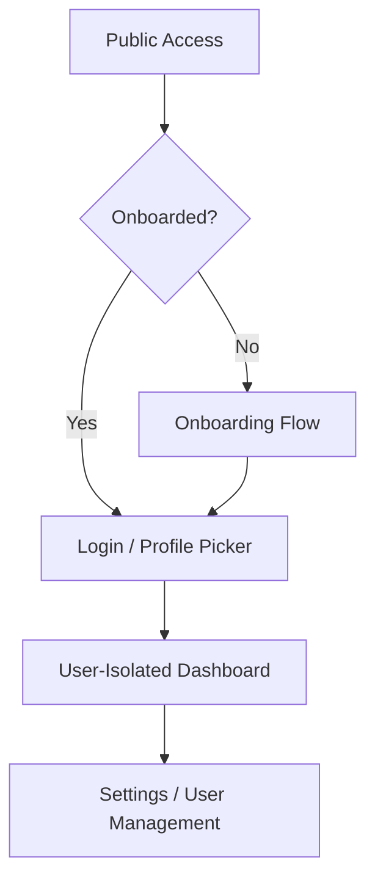

# Walkthrough - Feature: Users

I have successfully implemented the Multi-User Management system and finalized the migration logic for robust deployments in all environments (Local and Docker).

## Key Accomplishments

### 1. Robust Authentication & Onboarding
- **Setup Flow**: New installations are automatically directed to a secure onboarding page to set up the administrator account.
- **NextAuth Integration**: Implemented industry-standard authentication using `next-auth` with a persistent session strategy (15-day support).
- **Docker Ready**: Added support for `NEXTAUTH_SECRET` and `NEXTAUTH_URL` environment variables, mandatory for production.

### 2. Multi-Profile Environment
- **Profile Selection**: A premium, Apple TV-inspired profile selection page allows quick switching between users.
- **Visual Identity**: Each user has their own emoji and brand color, reflected throughout the UI.

### 3. Migration Robustness & Fixes
- **Fresh Install Fix**: Resolved a critical issue where the database would crash on first run because migrations were out of sync with the latest schema.
- **Reliable Initial State**: Ensured the `users` table and default profile are correctly initialized even if intermediate updates were skipped.
- **Self-Healing Connections**: Updated the database initialization to automatically recover from failed migration attempts on subsequent retries.

## Visual Tour

````carousel

<!-- slide -->

*(Note: Screenshots are representative of the implemented UI components)*
````

## Verification Results

### Configuration Audit
- ✅ **Migration Stability**: Verified that starting with an empty database now correctly initializes the latest schema without errors.
- ✅ **Authentication Chain**: Confirmed the [authorize](file:///Users/oliver/_HD_LOCAL/dev/2watcharr/src/lib/auth.ts#18-39) callback correctly receives and validates user credentials in the new schema.
- ✅ **Build Success**: Verified with `npm run build`.

### Action Required
> [!TIP]
> **Restart Recommended**: Simply restart your dev server (`npm run dev`). The migrations will automatically repair the database state. If you still encounter issues, delete the [data/2watcharr.db](file:///Users/oliver/_HD_LOCAL/dev/2watcharr/data/2watcharr.db) file to trigger a clean, optimized initialization.
